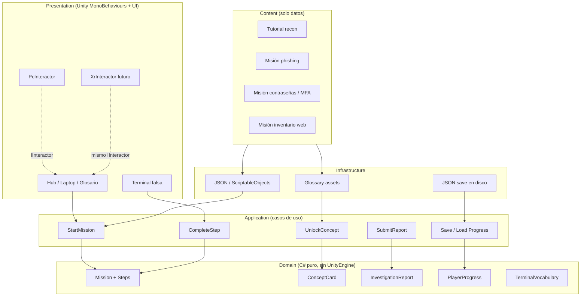

# EthicalLab — arquitectura

La UI no decide reglas; pide casos de uso. Las misiones viven en datos. VR entra por la misma `IInteractor`.

## Decisiones cerradas (2026-09-22)

| Riesgo | Decisión | Cómo se sostiene |
| --- | --- | --- |
| Doble fuente de contenido (JSON vs ScriptableObjects) | **`Assets/Resources/Content/missions.json` es la única fuente.** Los `.asset` de Academy son una vista generada; no se editan a mano. | `EthicalLab/Contenido/Regenerar ScriptableObjects desde JSON` sobrescribe y reordena. Al guardar el JSON se regeneran solos (`ContentSync.JsonWatcher`). Al abrir el editor, si un asset difiere, sale un warning con la lista. `Verificar coherencia` lo convierte en error. Web y EthicalLab ya leían el JSON. |
| Dos implementaciones Unity | **EthicalLab (`Assets/_Project`) es la canónica**: reglas en Domain, casos de uso en Application, tests EditMode sin Play Mode. `Academy.unity` queda como **prototipo de referencia congelado**: no se le agregan misiones ni reglas; sirve de donante de detalle 3D/UI hacia `HubOffice`/`HubHud`. | Solo EthicalLab tiene capas con `noEngineReferences`; una misión nueva es un cambio en el JSON y nada más. La migración pendiente es visual (uGUI en `HubHud`, acabado de la oficina), no de reglas. |
| El 3D era una antesala de paneles 2D | **El mundo ejecuta el bucle de aprendizaje**, no solo lo abre. Ver "Bucle 3D" abajo. | `WorldBinder` pinta el estado del dominio en los objetos; `LabBootstrap` traduce cada uso físico a un caso de uso. `ClueWorkflow` (Application, puro) decide qué paso toca y tiene test. |

### Bucle 3D (qué enseña cada objeto)

| Objeto | Acción física | Caso de uso | Qué aprende el jugador |
| --- | --- | --- | --- |
| Pizarra de tickets | E sobre un ticket | `StartMission` | Autorización primero: el ticket dice cliente y **alcance** en el toast. Color = bloqueado / disponible / en curso / cerrado con puntaje. |
| Servidor "Atlas" (fuera de alcance) | E | ninguno; muestra `mission.Scope` | Que algo esté al alcance de la mano no lo pone dentro del alcance autorizado. Sin castigo, con explicación. |
| Puerta del archivo, cajón | E | ninguno (mecanismo) | Las evidencias hay que ir a buscarlas; la cuarta pista vive en el cajón (USB de utilería). |
| Carpetas del archivo (una por pista del caso activo) | E o G: leer y tomar | `CompleteStep(<grupo>.clue)` | Observar antes de opinar. El panel de lectura muestra la pista y la pregunta con sus bandejas numeradas. |
| Bandejas del escritorio (una por opción) | E sobre la bandeja con la carpeta en mano | `CompleteStep(<grupo>.observe, choice)` y luego `(<grupo>.defend, choice)` | Clasificación física en dos pasos: primero **qué observo**, después **qué defensa aplico**. Error → toast con la pista de la misión y la carpeta sigue en mano. Acierto en la defensa → ficha desbloqueada y carpeta devuelta. |
| Laptop | E | abre terminal narrativa | La pantalla física muestra el `commandHint` del caso: la terminal es otra vía (`inspect`) al mismo `CompleteStep`. |
| Cuaderno | E | glosario / `UnlockConcept` | Síntesis: leer la ficha desbloqueada. |

El informe y el quiz siguen en el panel (`HubHud`): son escritura, no manipulación.



## Carpetas Unity

```text
Assets/_Project/
  Domain/           ← modelos y reglas (sin using UnityEngine)
  Application/      ← StartMission, CompleteStep, SubmitReport...
  Infrastructure/   ← leer ScriptableObjects / JSON, guardar progreso
  Presentation/     ← scripts de UI, PcInteractor, stubs de escena
  Shared/           ← Result, IDs, eventos opcionales
Assets/Content/
  Missions/
  Glossary/
  Terminal/
Assets/Scenes/
  Boot.unity
  Hub.unity
Assets/Tests/EditMode/
```

## Ensamblados

| asmdef | Referencias |
| --- | --- |
| `EthicalLab.Shared` | ninguna; `noEngineReferences` |
| `EthicalLab.Domain` | Shared; `noEngineReferences` |
| `EthicalLab.Application` | Domain + Shared |
| `EthicalLab.Infrastructure` | Domain + Application + Unity |
| `EthicalLab.Presentation` | Application + Infrastructure + Domain (solo lectura de modelos) + Unity |
| `EthicalLab.Tests` | Domain + Application + Shared (Editor) |

Presentation no puede contaminar Domain. Misión nueva = datos (`Assets/Resources/Content/missions.json`). Si hay que editar C# para añadir una misión, se rompió el diseño.

---

## Firmas por capa (contrato, sin implementar de nuevo)

### Shared — `EthicalLab.Shared`

```csharp
public readonly struct Result {
    public bool Ok { get; }
    public string Error { get; }
    public static Result Success();
    public static Result Fail(string error);
}

public readonly struct Result<T> {
    public bool Ok { get; }
    public T Value { get; }
    public string Error { get; }
    public static Result<T> Success(T value);
    public static Result<T> Fail(string error);
}

public readonly struct MissionId     { public string Value { get; } public MissionId(string value); }
public readonly struct ConceptId     { public string Value { get; } public ConceptId(string value); }
public readonly struct StepId        { public string Value { get; } public string ClueGroup { get; } public StepId(string value); }
public readonly struct InteractableId {
    public string Value { get; }
    public static InteractableId Laptop { get; }
    public static InteractableId Tickets { get; }
    public static InteractableId Board { get; }
    public static InteractableId Notebook { get; }
    public static InteractableId Terminal { get; }
}
```

### Domain — `EthicalLab.Domain` (C# puro)

```csharp
public enum StepKind {
    CollectClue,
    ClassifyItem,
    AnswerQuiz,
    WriteReportSection,
    UseTerminal
}

public sealed class ConceptCard {
    public ConceptId Id { get; }
    public string Name { get; }
    public string Category { get; }
    public string Definition { get; }
    public string Importance { get; }
    public string Defense { get; }
    public ConceptCard(ConceptId id, string name, string category, string definition, string importance, string defense);
}

public sealed class MissionStep {
    public StepId Id { get; }
    public StepKind Kind { get; }
    public string Prompt { get; }
    public string Body { get; }
    public IReadOnlyList<string> Options { get; }
    public int CorrectIndex { get; }
    public ConceptId Unlocks { get; }
    public bool UnlocksConcept { get; }
    public MissionStep(StepId id, StepKind kind, string prompt, string body, IReadOnlyList<string> options, int correctIndex, ConceptId unlocks);
}

public sealed class MissionDefinition {
    public MissionId Id { get; }
    public string Number { get; }
    public string Type { get; }
    public string Title { get; }
    public string Subtitle { get; }
    public string Client { get; }
    public string Duration { get; }
    public string Accent { get; }
    public string Brief { get; }
    public string Mentor { get; }
    public string Scope { get; }
    public string Objective { get; }
    public string CommandHint { get; }
    public string Learned { get; }
    public IReadOnlyList<ConceptId> Concepts { get; }
    public IReadOnlyList<MissionStep> Steps { get; }
    public MissionStep Step(StepId id);
}

public sealed class InvestigationReport {
    public MissionId Mission { get; }
    public string Prompt { get; }
    public IReadOnlyList<string> Options { get; }
    public int CorrectIndex { get; }
    public int SelectedIndex { get; }
    public bool Accepted { get; }
}

public sealed class StepProgress {
    public string Id;
    public bool Completed;
    public int Attempts;
    public int Selected;
}

public sealed class MissionProgress {
    public string Id;
    public bool Started;
    public bool ReportAccepted;
    public bool Completed;
    public float Seconds;
    public int ReportAttempts;
    public int ReportChoice;
    public int Score;
    public string Note;
    public List<StepProgress> Steps;
}

public sealed class PlayerProgress {
    public int Version;
    public string ActiveMission;
    public List<MissionProgress> Missions;
    public List<string> Unlocked;
    public List<string> Reviewed;
    public MissionProgress Get(string missionId);
    public StepProgress Step(string missionId, string stepId);
    public bool IsReviewed(ConceptId id);
    public bool IsUnlocked(ConceptId id);
    public int CompletedCount { get; }
}

public static class TerminalVocabulary {
    public static readonly string[] Commands; // help, scan, map, inspect, simulate, notes, report, clear
    public static bool IsKnown(string command);
}

public static class MissionCatalogRules {
    public static void Ensure(IReadOnlyList<MissionDefinition> missions, IReadOnlyList<ConceptCard> concepts, PlayerProgress progress);
    public static MissionDefinition Find(IReadOnlyList<MissionDefinition> missions, string id);
    public static bool IsAvailable(IReadOnlyList<MissionDefinition> missions, PlayerProgress progress, MissionId id);
    public static Result Start(IReadOnlyList<MissionDefinition> missions, PlayerProgress progress, MissionId id);
    public static Result CompleteStep(MissionDefinition mission, PlayerProgress progress, StepId stepId, int choice);
    public static Result Review(PlayerProgress progress, ConceptId id);
    public static Result CompleteMission(MissionDefinition mission, PlayerProgress progress);
    public static int Score(MissionDefinition mission, PlayerProgress progress);
}

public static class MissionStepFactory {
    public static IReadOnlyList<MissionStep> FromEvidence(
        IReadOnlyList<EvidenceSeed> evidence,
        string reportPrompt,
        IReadOnlyList<string> reportOptions,
        int reportAnswer,
        IReadOnlyList<QuizSeed> quiz);
}
```

### Application — `EthicalLab.Application`

```csharp
public interface IMissionRepository {
    IReadOnlyList<MissionDefinition> Missions { get; }
    IReadOnlyList<ConceptCard> Concepts { get; }
    MissionDefinition GetMission(MissionId id);
    ConceptCard GetConcept(ConceptId id);
}

public interface IProgressStore {
    PlayerProgress Load();
    void Save(PlayerProgress progress);
}

public sealed class StepAnswer {
    public int Choice;
    public string Text;
}

public sealed class StartMission {
    public StartMission(IMissionRepository catalog, PlayerProgress progress);
    public Result Execute(MissionId id);
}

public sealed class CompleteStep {
    public CompleteStep(IMissionRepository catalog, PlayerProgress progress);
    public Result Execute(StepId step, StepAnswer answer);
}

public sealed class UnlockConcept {
    public UnlockConcept(PlayerProgress progress);
    public Result Execute(ConceptId id); // marca ficha leída (ya desbloqueada)
}

public sealed class SubmitReport {
    public SubmitReport(IMissionRepository catalog, PlayerProgress progress);
    public Result Execute(int conclusionIndex);
    public Result CloseIfReady();
}

public sealed class SaveLoadProgress {
    public SaveLoadProgress(IProgressStore store, PlayerProgress progress);
    public PlayerProgress Load();
    public void Save();
}

public sealed class LabUseCases {
    public IMissionRepository Catalog { get; }
    public PlayerProgress Progress { get; }
    public StartMission StartMission { get; }
    public CompleteStep CompleteStep { get; }
    public UnlockConcept UnlockConcept { get; }
    public SubmitReport SubmitReport { get; }
    public SaveLoadProgress SaveLoad { get; }
    public LabUseCases(IMissionRepository catalog, IProgressStore store);
    public MissionDefinition Active { get; }
    public void Tick(float seconds);
}

public static class NarrativeTerminal {
    public static string Execute(LabUseCases app, string input);
}
```

Los casos de uso reciben `IMissionRepository` / `IProgressStore`, nunca ScriptableObjects concretos.

### Infrastructure — `EthicalLab.Infrastructure`

```csharp
public sealed class JsonMissionRepository : IMissionRepository {
    public IReadOnlyList<MissionDefinition> Missions { get; }
    public IReadOnlyList<ConceptCard> Concepts { get; }
    public JsonMissionRepository(string json);
    public static JsonMissionRepository FromResources(); // Resources/Content/missions.json
    public MissionDefinition GetMission(MissionId id);
    public ConceptCard GetConcept(ConceptId id);
}

public sealed class JsonProgressStore : IProgressStore {
    public string Path { get; } // persistentDataPath/ethicallab-progress-v1.json
    public PlayerProgress Load();
    public void Save(PlayerProgress progress);
}
```

Las 4 misiones del MVP son datos, no clases.

### Presentation — `EthicalLab.Presentation`

```csharp
public interface IInteractor {
    event Action<InteractableId> Used;
    event Action<InteractableId> Grabbed;
    event Action<InteractableId> Released;
    event Action<InteractableId, bool> Hovered;
}

// InteractableId (Shared): "kind" o "kind:arg".
// laptop | notebook | board | ticket:<missionId> | clue:<grupo> | tray:<índice> | scope | door | drawer

public sealed class PcInteractor : MonoBehaviour, IInteractor {
    // WASD, Shift, botón derecho mirar, E/clic usar, G tomar/devolver.
    public bool MenuOpen;
    public string Prompt { get; }
    public InteractableView Held { get; }
    public void Take(InteractableView view); // a la mano (ancla hija de la cámara; futura mano XR)
    public void Drop();
    public event Action<InteractableId> Used;
    public event Action<InteractableId> Grabbed;
    public event Action<InteractableId> Released;
    public event Action<InteractableId, bool> Hovered;
}

public sealed class XrInteractor : IInteractor {
    public void Hover(InteractableId id, bool on);
    public void Use(InteractableId id);
    public void Grab(InteractableId id);
    public void Release(InteractableId id);
}

public sealed class HubScene {
    public Camera Camera; public PcInteractor Person; public Transform Root;
    public TextMesh LaptopScreen, BoardTitle, TrayHeader;
    public List<InteractableView> Tickets, Folders, Trays;
    public InteractableView OutOfScope;
    public HubMechanism Door, Drawer;
}

public static class HubOffice {
    public static HubScene Build(); // sala + archivo + puerta + cajón + Player CharacterController + cámara FP
}

public sealed class HubMechanism : MonoBehaviour { // Door (bisagra) | Drawer (deslizante)
    public MechanismKind kind; public Transform movingPart;
    public void Toggle();
}

public sealed class WorldBinder : MonoBehaviour {
    // Solo lee: tickets (color/estado), laptop (commandHint), carpetas (pistas del caso), bandejas (opciones del paso pendiente).
    public LabUseCases App; public HubScene Scene;
}

public sealed class HubHud : MonoBehaviour {
    public LabUseCases App;
    public PcInteractor Person;
    public void Open(string target); // terminal | glossary | missions | case | home
    public void Toast(string text);  // feedback en el mundo, con tiempo
    public void Reading(string text); // panel de lectura de la pista en mano ("" oculta)
}

public sealed class LabBootstrap : MonoBehaviour {
    // Play en Hub / Boot. Traduce Used/Grabbed/Released → StartMission / CompleteStep.
    // No arranca en escena vacía ni si existe "Analyst Academy".
}

public sealed class InteractableView : MonoBehaviour {
    public string id, prompt; public bool grabbable; public TextMesh sign;
    public InteractableId Id { get; }
    public bool IsHeld { get; }
    public void Focus(bool on);
    public void Tint(Color color);
    public void Label(string text);
    public void Grab(Transform hand);
    public void Release();
}
```

Editor (solo `Assets/_Project/Editor`, referencia `Academy.Runtime` para regenerar sus assets):

```csharp
public static class ContentSync {
    public static void Regenerate(); // menú EthicalLab/Contenido/Regenerar… (sobrescribe assets desde JSON)
    public static void Verify();     // menú EthicalLab/Contenido/Verificar coherencia…
    public static List<string> Drift(); // vacía = coherente
}
```

`XrInteractor` usa la misma `IInteractor`. Domain no se toca cuando entre VR.

### Tests EditMode — `EthicalLab.Tests`

```csharp
// StartMission → completar pasos → UnlockConcept → SubmitReport
// assert score == 100 y conceptos desbloqueados. Sin Play Mode.
public sealed class UseCaseTests {
    public void StartMission_CompleteSteps_UnlockConcept_SubmitReport_Scores();
    public void ClueWorkflow_DrivesPhysicalFolderThroughObserveThenDefend();
    public void TerminalRejectsRealTools();
}
```

Los mismos tests corren **sin Unity** con `scripts/test-dotnet.sh` (SDK .NET 8; se instala en `~/.dotnet` si falta):

| Paso | Proyecto (`Tools/`) | Qué prueba |
| --- | --- | --- |
| 1 | `EthicalLab.Pure` (netstandard2.1, C# 9) | Shared + Domain + Application compilan con la misma superficie de API que Unity 6 da a un asmdef con `noEngineReferences`. |
| 2 | `EthicalLab.PureTests` (NUnit 3) | `Assets/Tests/EditMode/*.cs` tal cual, contra el paso 1. |
| 3 | `EthicalLab.SyntaxCheck` (Roslyn) | Todo `Assets/**/*.cs` parsea como C# 9. Atrapa errores de sintaxis en Presentation / Infrastructure / Editor, que sí dependen de `UnityEngine`. |

Lo que este harness **no** cubre: errores de tipo contra la API de `UnityEngine` (Presentation, Infrastructure, Editor, y todo `Assets/Scripts`). Eso lo confirma el compilador de Unity al abrir el proyecto. Como Domain y Application concentran las reglas, la parte con lógica de negocio queda verificada aquí.

---

## Cómo jugar (primera persona)

| Escena | Qué arranca |
| --- | --- |
| `Hub.unity` o `Boot.unity` | EthicalLab: oficina + `PcInteractor` (CharacterController) |
| `Academy.unity` | Prototipo del otro desarrollador (CharacterController, agachar, agarrar) |

Controles EthicalLab: **WASD** caminar, **Shift** correr, **botón derecho** mirar, **E / clic** usar, **G** tomar / devolver carpeta, **ESC** menú de casos de uso.

Recorrido de un caso en el mundo: pizarra (aceptar ticket) → archivo (abrir puerta, leer carpeta) → escritorio (soltar la carpeta en la bandeja de la observación correcta, luego en la de la defensa) → cuaderno (ficha) → laptop o ESC (informe y quiz).

Terminal narrativa: `scan`, `inspect`, `notes`, `report`. No hay herramientas de ataque.

Regla de oro: misión nueva = datos. Si hay que editar C# para añadir una misión, se rompió la arquitectura.
